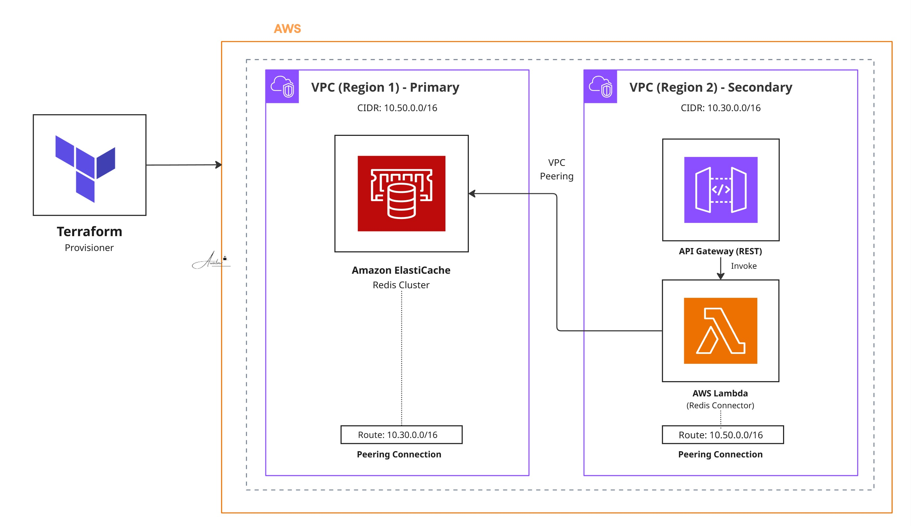

# Project 20: VPC Peering Redis Connector

A Terraform module that sets up multi-region VPC peering setup that will be used to establic connection between lambda deployed in second region to connect elasticache redis deployed in region 1. 

## Architecture



## What It Provisions

**Network layer (`main.tf`)**

- Secondary region VPC, subnet, and route table
- VPC peering connection between the primary and secondary regions
- Bidirectional routes in both regions so traffic can flow either way over the peering link

**Application layer (`components/main.tf`)**

- Security group allowing TCP 6379 (Redis) inbound
- IAM execution role with VPC access permissions
- Lambda function (`redis-connector`) deployed inside the secondary region VPC
- Lambda Function URL with CORS enabled
- API Gateway REST API proxied to the Lambda

## Stack

Terraform 1.x · AWS Lambda (Node.js 18.x) · VPC Peering · ElastiCache Redis · API Gateway · IAM · CloudWatch Logs

## Prerequisites

- Terraform >= 1.0
- AWS CLI configured with access to both regions
- An existing primary-region VPC with an ElastiCache Redis cluster running on port 6379
- `lambda_function_payload.zip` containing the Node.js Redis connector handler placed in the repo root before applying (not checked in)

## Deployment

```bash
terraform init
terraform plan -out=tfplan
terraform apply tfplan
terraform output
```

Outputs include the VPC peering connection ID, Lambda Function URL, API Gateway endpoint URL, and Lambda function name.

## Testing

Lambda Function URL:

```bash
curl -X POST https://<lambda-url>/resource \
  -H "Content-Type: application/json" \
  -d '{"command":"GET","key":"mykey"}'
```

API Gateway:

```bash
curl -X POST https://<api-id>.execute-api.<region>.amazonaws.com/prod/resource \
  -H "Content-Type: application/json" \
  -d '{"command":"SET","key":"mykey","value":"myvalue"}'
```

Verify the peering connection is active:

```bash
aws ec2 describe-vpc-peering-connections \
  --region <region-1> \
  --filters "Name=status-code,Values=active"
```

## Notes

- CORS is currently set to `*`. Restrict to specific origins before moving to production.
- API Gateway has no authorizer configured. Add IAM or Cognito authorization for production use.
- Redis credentials are passed as Lambda environment variables. Move them to AWS Secrets Manager for anything beyond a development setup.
- The secondary region uses a single subnet in one AZ. Add a second subnet and update the Lambda VPC config for high availability.
- VPC Flow Logs are not enabled. Add them for network-level visibility in production.
